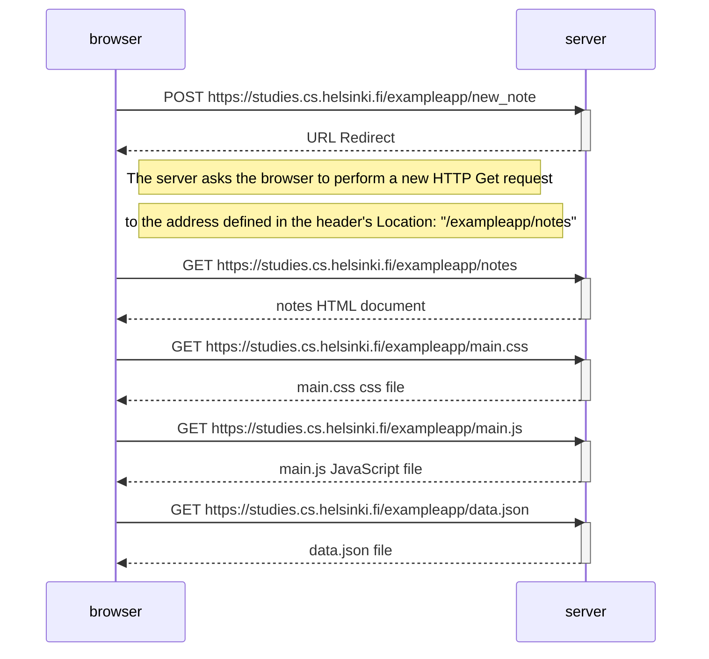
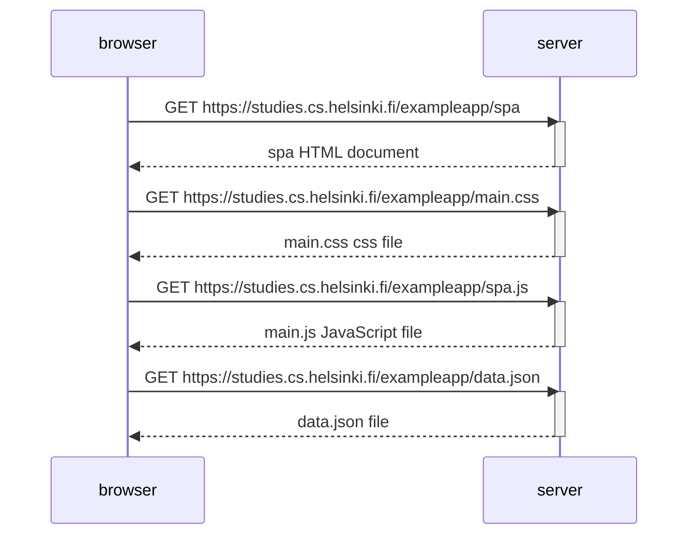
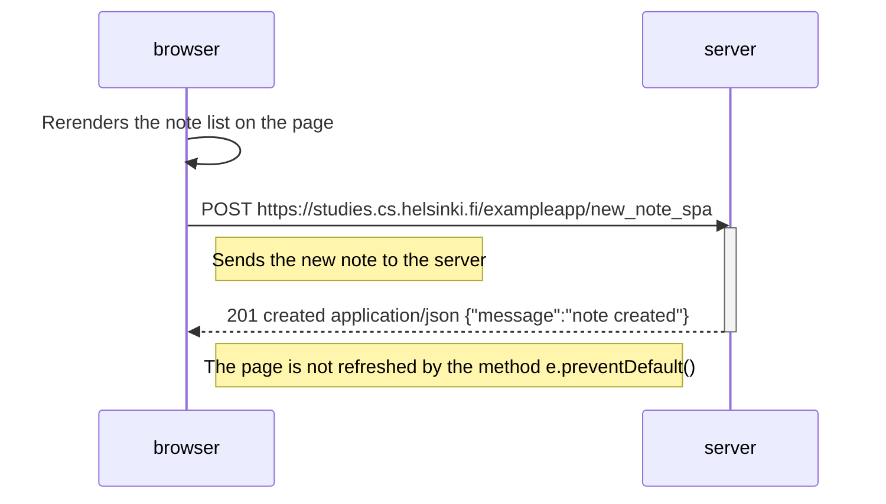

# Part 0 Solutions

## 0.1 to 0.3 solutions

No solutions needed, only reading

## 0.4: New note diagram
Only need to add 1 step from the existing Sequence Diagram which is the POST request which triggers a series of reloading the webpage after the POST.

## 0.5 Single page app diagram
The single page app is still pretty similar to the original example app when opening the page. It first send GET request for the html. After rendering the html it sent 2 GET request to for the CSS and JavaScript, and the JavaScript will sent GET request for the data.json.

## 0.6 New note in Single page app diagram

